# Laporan Modul 7: ELOQUENT RELATIONSHIP & PAGINATION
**Mata Kuliah:** Workshop Web Lanjut    
**Nama:** Muhammad Dhiyaul Atha 
**NIM:** 2024573010075  
**Kelas:** TI2B  

---

## Abstrak
Praktikum ini meninjau implementasi Eloquent Relationship dan Pagination dalam Laravel. Materi Relationship mencakup definisi dan penggunaan relasi One-to-One, One-to-Many, dan Many-to-Many antar model untuk memfasilitasi interaksi antartabel secara deklaratif tanpa query SQL mentah.

Pagination diperkenalkan melalui penggunaan method paginate() untuk membagi dataset besar menjadi bagian-bagian kecil guna menjaga keterbacaan tampilan dan efisiensi performa aplikasi.
Praktikum mencakup penyusunan migration, model, seeder, controller, dan view serta pengujian fungsi relasi dan paginasi sebagai bagian dari proses pengembangan aplikasi Laravel yang terstruktur.

---

## 1. Dasar Teori
### Eloquent Relationship

Eloquent Relationship mendefinisikan hubungan antar tabel dalam database. Ada tiga jenis relasi utama:

1. **One-to-One**  
   Relasi ini menunjukkan bahwa satu entitas hanya berhubungan dengan satu entitas lain.  
   Contoh: `User` memiliki satu `Profile`.

        // Model User
        public function profile()
        {
            return $this->hasOne(Profile::class);
        }

        // Model Profile
        public function user()
        {
            return $this->belongsTo(User::class);
        }

2. **One-to-Many**
    Relasi ini digunakan ketika satu data di tabel utama memiliki banyak data terkait di tabel lain.
    Contoh: User memiliki banyak Post.

        // Model User
        public function posts()
        {
            return $this->hasMany(Post::class);
        }

        // Model Post
        public function user()
        {
            return $this->belongsTo(User::class);
        }

3. **Many-to-Many**
    Relasi ini menunjukkan bahwa banyak data dari satu tabel bisa berhubungan dengan banyak data dari tabel lain.
    Contoh: Post memiliki banyak Tag, dan Tag dimiliki banyak Post.

        // Model Post
        public function tags()
        {
            return $this->belongsToMany(Tag::class);
        }

        // Model Tag
        public function posts()
        {
            return $this->belongsToMany(Post::class);
        }

    Tabel perantara (pivot table) digunakan untuk menyimpan hubungan Many-to-Many tersebut.

### Pagination
Pagination atau penomoran halaman adalah proses membagi data menjadi beberapa halaman agar tidak semuanya ditampilkan sekaligus.
Laravel memiliki fitur bawaan untuk pagination dengan method `paginate()`.

Contoh:

    $products = Product::orderBy('id', 'desc')->paginate(10);

Untuk menampilkan tautan pagination di view:

    {{ $products->links() }}

Pagination membantu meningkatkan performa aplikasi dan memberikan pengalaman pengguna yang lebih baik.

## 2. Langkah-Langkah Praktikum
### 2.1 Praktikum 1 – Eloquent ORM Relationships: One-to-One, One-to-Many, Many-to-Many

>Langkah-langkah:

1. Buat Projek laravel pada terminal vscode

        laravel new complex-relationships

    Atau jika menggunakan composer:
        
        composer create-project laravel/laravel complex-relationships
    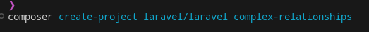

    lalu masuk ke dalam folder projek tsb.

    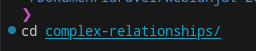

3. Install Dependency MySQL

     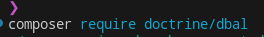

4. Sesuaikan seperti berikut pada file .env
   
    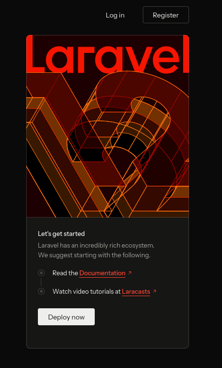

    lalu bersihkan config cache menggunakan perintah `artisan`:
        
    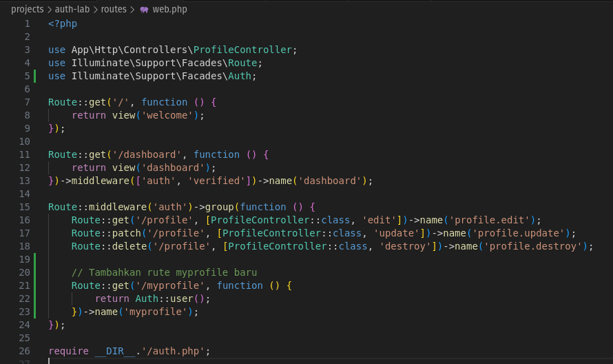

5. Buat Migrasi untuk tabel berikut

    dengan perintah artisan:

        php artisan make:migration create_profiles_table
        php artisan make:migration create_posts_table
        php artisan make:migration create_tags_table
        php artisan make:migration create_post_tag_table

    Buka file yang telah dibuat di `database/migrations/YYYY_MM_DD_create_profiles_table.php` lalu ganti dengan:

        <?php

        use Illuminate\Database\Migrations\Migration;
        use Illuminate\Database\Schema\Blueprint;
        use Illuminate\Support\Facades\Schema;

        return new class extends Migration {
            public function up()
            {
                Schema::create('profiles', function (Blueprint $table) {
                    $table->id();
                    $table->unsignedBigInteger('user_id')->unique();
                    $table->text('bio')->nullable();
                    $table->string('website')->nullable();
                    $table->timestamps();

                    $table->foreign('user_id')->references('id')->on('users')->onDelete('cascade');
                });
            }

            public function down()
            {
                Schema::dropIfExists('profiles');
            }
        };

    Buka file yang telah dibuat di `database/migrations/YYYY_MM_DD_create_posts_table.php` lalu ganti dengan:

        <?php

        use Illuminate\Database\Migrations\Migration;
        use Illuminate\Database\Schema\Blueprint;
        use Illuminate\Support\Facades\Schema;

        return new class extends Migration {
            public function up()
            {
                Schema::create('posts', function (Blueprint $table) {
                    $table->id();
                    $table->unsignedBigInteger('user_id');
                    $table->string('title');
                    $table->text('content');
                    $table->timestamps();

                    $table->foreign('user_id')->references('id')->on('users')->onDelete('cascade');
                });
            }

            public function down()
            {
                Schema::dropIfExists('posts');
            }
        };

    Buka file yang telah dibuat di `database/migrations/YYYY_MM_DD_create_tags_table.php` lalu ganti dengan:

        <?php

        use Illuminate\Database\Migrations\Migration;
        use Illuminate\Database\Schema\Blueprint;
        use Illuminate\Support\Facades\Schema;

        return new class extends Migration {
            public function up()
            {
                Schema::create('tags', function (Blueprint $table) {
                    $table->id();
                    $table->string('name')->unique();
                    $table->timestamps();
                });
            }

            public function down()
            {
                Schema::dropIfExists('tags');
            }
        };

    Buka file yang telah dibuat di `database/migrations/YYYY_MM_DD_create_post_tag_table.php` lalu ganti dengan:

        <?php

        use Illuminate\Database\Migrations\Migration;
        use Illuminate\Database\Schema\Blueprint;
        use Illuminate\Support\Facades\Schema;

        return new class extends Migration {
            public function up()
            {
                Schema::create('post_tag', function (Blueprint $table) {
                    $table->id();
                    $table->unsignedBigInteger('post_id');
                    $table->unsignedBigInteger('tag_id');
                    $table->timestamps();

                    $table->foreign('post_id')->references('id')->on('posts')->onDelete('cascade');
                    $table->foreign('tag_id')->references('id')->on('tags')->onDelete('cascade');
                });
            }

            public function down()
            {
                Schema::dropIfExists('post_tag');
            }
        };
    
    Jalankan Migrasi dengan perintah artisan
        
        php artisan migrate
    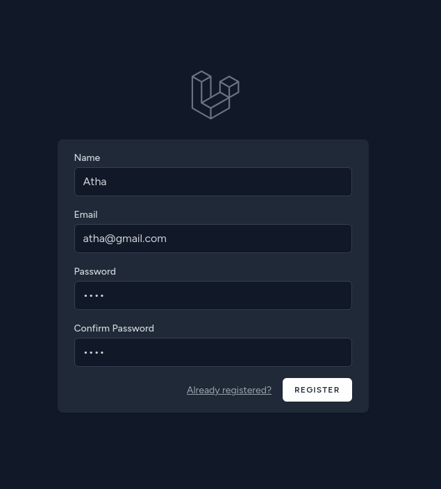
    
    pilih yes untuk menambahkan database ke mysql

6. Buat Seeder untuk tabel todos

    dengan perintah artisan:

        php artisan make:seeder DatabaseSeeder

    Buka file yang telah dibuat di `database/seeder/DatabaseSeeder.php` lalu ganti dengan:

        <?php

        namespace Database\Seeders;

        use App\Models\User;
        use App\Models\Profile;
        use App\Models\Post;
        use App\Models\Tag;
        use Illuminate\Database\Console\Seeds\WithoutModelEvents;
        use Illuminate\Database\Seeder;

        class DatabaseSeeder extends Seeder
        {
            /**
            * Run the database seeds.
            */
            public function run(): void
            {
                // Membuat 10 user menggunakan factory
                User::factory(10)->create();

                // Membuat profile untuk setiap user
                foreach (User::all() as $user) {
                    $user->profile()->create([
                        'bio' => 'Ini adalah bio untuk user ' . $user->id,
                        'website' => 'https://ilmudata.id/user/' . $user->id,
                    ]);
                }

                // Membuat post untuk setiap user
                foreach (User::all() as $user) {
                    $user->posts()->create([
                        'title' => 'Judul Post untuk user ' . $user->id,
                        'content' => 'Ini adalah konten dari post untuk user ' . $user->id,
                    ]);
                }

                // Membuat tag dan mengasosiasikannya dengan posts
                foreach (Post::all() as $post) {
                    $tag = Tag::create(['name' => 'Tag untuk post ' . $post->id]);
                    $post->tags()->attach($tag->id);
                }        
            }
        }

    
    Jalankan Seeder dengan perintah artisan
        
        php artisan db:seed

7. Ganti isi route pada routes/web.php.

        <?php

        use Illuminate\Support\Facades\Route;
        use App\Http\Controllers\UserController;
        use App\Http\Controllers\PostController;

        // Routes untuk User
        Route::get('/users', [UserController::class, 'index'])->name('users.index');
        Route::get('/users/{user}', [UserController::class, 'show'])->name('users.show');

        // Routes untuk Post
        Route::get('/posts', [PostController::class, 'index'])->name('posts.index');
        Route::get('/posts/{post}', [PostController::class, 'show'])->name('posts.show');

8. Buat Model .

   Buat file berikut dengan perintah artisan: 

        php artisan make:model Profile
        php artisan make:model Post
        php artisan make:model Tag

   Masuk ke file `app/Models/Profile` dan ganti menjadi code berikut:

        <?php

        namespace App\Models;

        use Illuminate\Database\Eloquent\Model;
        use Illuminate\Database\Eloquent\Factories\HasFactory;
        use App\Models\User;

        class Profile extends Model
        {
            use HasFactory;

            /**
            * Kolom yang dapat diisi secara massal
            */
            protected $fillable = ['user_id', 'bio', 'website'];

            /**
            * Relasi inverse One-to-One dengan User
            */
            public function user()
            {
                return $this->belongsTo(User::class);
            }
        }

    Masuk ke file `app/Models/Post` dan ganti menjadi code berikut:

        <?php

        namespace App\Models;

        use Illuminate\Database\Eloquent\Model;
        use Illuminate\Database\Eloquent\Factories\HasFactory;
        use App\Models\User;
        use App\Models\Tag;

        class Post extends Model
        {
            use HasFactory;

            /**
            * Kolom yang dapat diisi secara massal
            */
            protected $fillable = ['user_id', 'title', 'content'];

            /**
            * Relasi inverse One-to-Many dengan User
            */
            public function user()
            {
                return $this->belongsTo(User::class);
            }

            /**
            * Relasi Many-to-Many dengan Tag
            */
            public function tags()
            {
                return $this->belongsToMany(Tag::class);
            }
        }

    Masuk ke file `app/Models/Tag` dan ganti menjadi code berikut:

        <?php

        namespace App\Models;

        use Illuminate\Database\Eloquent\Model;
        use Illuminate\Database\Eloquent\Factories\HasFactory;
        use App\Models\Post;

        class Tag extends Model
        {
            use HasFactory;

            /**
            * Kolom yang dapat diisi secara massal
            */
            protected $fillable = ['name'];

            /**
            * Relasi Many-to-Many dengan Post
            */
            public function posts()
            {
                return $this->belongsToMany(Post::class);
            }
        }

    Masuk ke file `app/Models/User` dan ganti menjadi code berikut:

        <?php

        namespace App\Models;

        // use Illuminate\Contracts\Auth\MustVerifyEmail;
        use Illuminate\Database\Eloquent\Factories\HasFactory;
        use Illuminate\Foundation\Auth\User as Authenticatable;
        use Illuminate\Notifications\Notifiable;

        class User extends Authenticatable
        {
            /** @use HasFactory<\Database\Factories\UserFactory> */
            use HasFactory, Notifiable;

            /**
            * The attributes that are mass assignable.
            *
            * @var list<string>
            */
            protected $fillable = [
                'name',
                'email',
                'password',
            ];

            /**
            * Relasi One-to-One dengan Profile
            */
            public function profile()
            {
                return $this->hasOne(Profile::class);
            }

            /**
            * Relasi One-to-Many dengan Post
            */
            public function posts()
            {
                return $this->hasMany(Post::class);
            }

            /**
            * The attributes that should be hidden for serialization.
            *
            * @var list<string>
            */
            protected $hidden = [
                'password',
                'remember_token',
            ];

            /**
            * Get the attributes that should be cast.
            *
            * @return array<string, string>
            */
            protected function casts(): array
            {
                return [
                    'email_verified_at' => 'datetime',
                    'password' => 'hashed',
                ];
            }
        }

9. Buat controller.

    Buat controller berikut dengan perintah artisan: 

        php artisan make:controller UserController
        php artisan make:controller PostController

    Masuk ke file `app/Http/Controllers/UserController` dan ganti menjadi kode berikut:

        <?php

        namespace App\Http\Controllers;

        use Illuminate\Http\Request;
        use App\Models\User;

        class UserController extends Controller
        {
            /**
            * Menampilkan daftar semua user dengan profile dan posts terkait
            */
            public function index() 
            {
                $users = User::with('profile', 'posts')->get();
                return view('users.index', compact('users'));
            }

            /**
            * Menampilkan detail user tertentu
            */
            public function show(User $user) 
            {
                // Menggunakan route model binding, Laravel akan otomatis 
                // mencari user berdasarkan ID yang diberikan
                return view('users.show', compact('user'));
            }
        }

    Masuk ke file `app/Http/Controllers/PostController` dan ganti menjadi kode berikut:

        <?php

        namespace App\Http\Controllers;

        use Illuminate\Http\Request;
        use App\Models\Post;

        class PostController extends Controller
        {
            /**
            * Menampilkan daftar semua posts dengan user dan tags terkait
            */
            public function index() 
            {
                $posts = Post::with('user', 'tags')->get();
                return view('posts.index', compact('posts'));
            }

            /**
            * Menampilkan detail post tertentu
            */
            public function show(Post $post)
            {
                // Menggunakan route model binding, Laravel akan otomatis
                // mencari post berdasarkan ID yang diberikan
                return view('posts.show', compact('post'));
            }
        }

10. Buat directory berikut di `resources\views`
        mkdir resources/views/layouts
        mkdir resources/views/posts
        mkdir resources/views/users

    Buat file `app.blade.php` dengan perintah touch: 

        touch resources/views/layouts/app.blade.php

    Masuk ke file `resources/views/layouts/app.blade.php` dan isikan code berikut:

        <!DOCTYPE html>
        <html lang="en">
        <head>
            <meta charset="UTF-8">
            <meta name="viewport" content="width=device-width, initial-scale=1.0">
            <title>@yield('title')</title>
            <link href="https://cdn.jsdelivr.net/npm/bootstrap@5.3.3/dist/css/bootstrap.min.css" rel="stylesheet">
        </head>
        <body class="container mt-4">

            <h1 class="text-center mb-4">Laravel 12 Complex Relationships</h1>

            @if(session('success'))
                
{{ session('success') }}

            @endif

            <nav class="mb-4">
                <a href="{{ route('users.index') }}" class="btn btn-primary">Users</a>
                <a href="{{ route('posts.index') }}" class="btn btn-secondary">Posts</a>
            </nav>

            @yield('content')

        </body>
        </html>

    Buat file `index.blade.php` dengan perintah touch: 

        touch resources/views/posts/index.blade.php

    Masuk ke file `resources/views/posts/index.blade.php` dan isikan code berikut:

        @extends('layouts.app')

        @section('title', 'Posts')

        @section('content')
            <h2>All Posts</h2>

            <ul class="list-group">
                @foreach($posts as $post)
                    <li class="list-group-item">
                        <a href="{{ route('posts.show', $post->id) }}">{{ $post->title }}</a> by {{ $post->user->name }}
                    </li>
                @endforeach
            </ul>
        @endsection

    Buat file `show.blade.php` dengan perintah touch: 

        touch resources/views/posts/show.blade.php

    Masuk ke file `resources/views/posts/show.blade.php` dan isikan code berikut:

        @extends('layouts.app')

        @section('title', 'Post Details')

        @section('content')
            <h2>{{ $post->title }}</h2>
            
<strong>Author:</strong> {{ $post->user->name }}

            
{{ $post->content }}

            <h3>Tags</h3>
            <ul class="list-group">
                @foreach($post->tags as $tag)
                    <li class="list-group-item">{{ $tag->name }}</li>
                @endforeach
            </ul>

            <a href="{{ route('posts.index') }}" class="btn btn-secondary mt-3">Back to Posts</a>
        @endsection

    Buat file `index.blade.php` dengan perintah touch: 

        touch resources/views/users/index.blade.php

    Masuk ke file `resources/views/users/index.blade.php` dan isikan code berikut:

        @extends('layouts.app')

        @section('title', 'Users')

        @section('content')
            <h2>Users List</h2>
            <ul class="list-group">
                @foreach($users as $user)
                    <li class="list-group-item">
                        <a href="{{ route('users.show', $user->id) }}">{{ $user->name }}</a> ({{ $user->email }})
                    </li>
                @endforeach
            </ul>
        @endsection

    Buat file `show.blade.php` dengan perintah touch: 

        touch resources/views/users/show.blade.php

    Masuk ke file `resources/views/users/show.blade.php` dan isikan code berikut:

        @extends('layouts.app')

        @section('title', 'User Profile')

        @section('content')
            <h2>{{ $user->name }}'s Profile</h2>
            
Email: {{ $user->email }}

            <h3>Profile Details</h3>
            
Bio: {{ $user->profile->bio ?? 'No bio available' }}

            
Website: <a href="{{ $user->profile->website ?? '#' }}">{{ $user->profile->website ?? 'No website' }}</a>

            <h3>Posts</h3>
            <ul class="list-group">
                @foreach($user->posts as $post)
                    <li class="list-group-item">
                        <a href="{{ route('posts.show', $post->id) }}">{{ $post->title }}</a>
                    </li>
                @endforeach
            </ul>
        @endsection

11. Jalankan aplikasi dan tunjukkan hasil di browser.

    Jalankan Mysql lalu
    Untuk menjalankan aplikasi kita bisa menggunakan perintah artisan berikut:

        php artisan serve

    masuk ke browser lalu kunjungi http://127.0.0.1:8000/users

>Screenshot Hasil:
- users page

    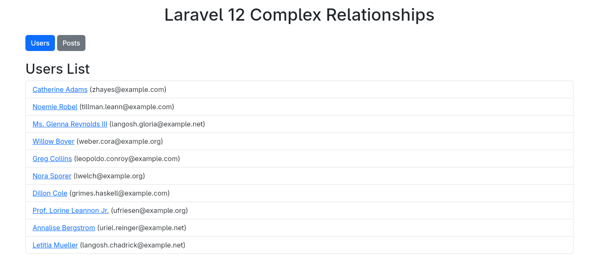

- posts page

    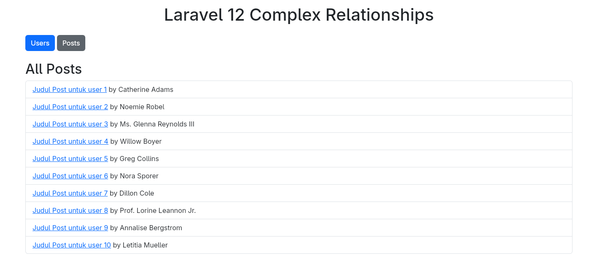

- profile user

    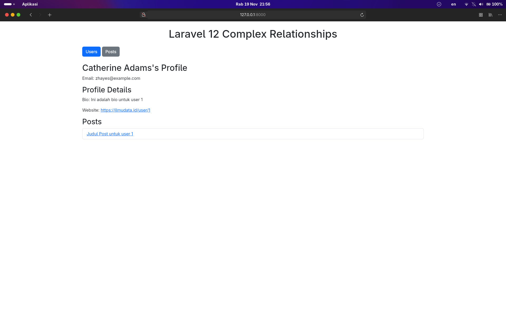

- post detail

    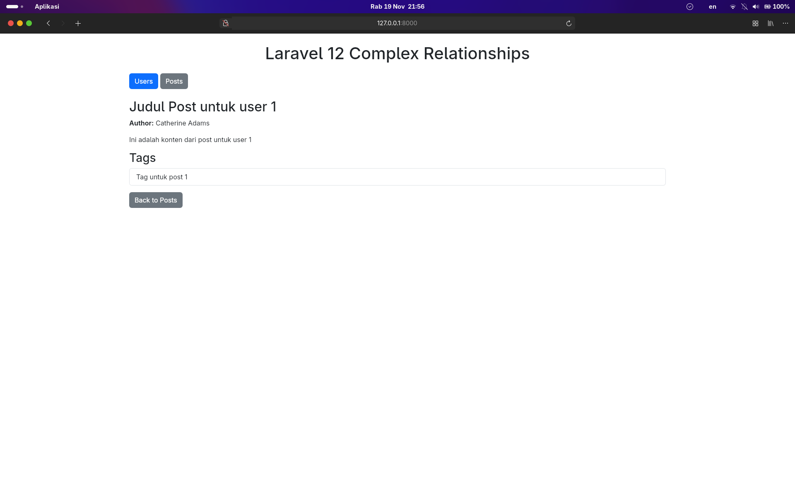

### 2.2 Praktikum 2 – Paginasi dengan Eloquent ORM

>Langkah-langkah:

1. Buat Projek laravel pada terminal vscode

        laravel new productpagination

    lalu masuk ke dalam folder projek tsb.

        cd productpagination

    pada penginstalan 
    pilih mysql sebagai database lalu
    pilih **no** ketika ditanya migration database

2. intall Dependency MySQL

        composer require doctrine/dbal

3.  sesuaikan seperti berikut pada file .env

        DB_CONNECTION=mysql
        DB_HOST=127.0.0.1
        DB_PORT=3306
        DB_DATABASE=pagination_db;
        DB_USERNAME=
        DB_PASSWORD=

    lalu bersihkan config cache menggunakan perintah `artisan`:
        
        php artisan config:clear

4.  Buat Model dan Migrasi Product

    dengan perintah artisan:

        php artisan make:model Product -m

    Buka file yang telah dibuat di `database/migrations/YYYY_MM_DD_create_products_table.php` lalu ganti dengan:

        <?php

        use Illuminate\Database\Migrations\Migration;
        use Illuminate\Database\Schema\Blueprint;
        use Illuminate\Support\Facades\Schema;

        return new class extends Migration
        {
            /**
            * Run the migrations.
            */
            public function up(): void
            {
                Schema::create('products', function (Blueprint $table) {
                    $table->id();
                    $table->string('name');
                    $table->decimal('price', 10, 2);
                    $table->timestamps();
                });
            }

            /**
            * Reverse the migrations.
            */
            public function down(): void
            {
                Schema::dropIfExists('products');
            }
        };
    
    Jalankan Migrasi dengan perintah artisan
        
        php artisan migrate

5.   Buat Seeder untuk tabel product

    dengan perintah artisan:

        php artisan make:seeder ProductSeeder

    Buka file yang telah dibuat di `database/seeder/ProductSeeder.php` lalu ganti dengan:

        <?php

        namespace Database\Seeders;

        use Illuminate\Database\Console\Seeds\WithoutModelEvents;
        use Illuminate\Database\Seeder;
        use App\Models\Product;

        class ProductSeeder extends Seeder
        {
            /**
            * Run the database seeds.
            */
            public function run(): void
            {
                Product::factory()->count(50)->create();
            }
        }
    
    Buka file `database/seeder/DatabaseSeeder.php` lalu ganti dengan:

        <?php

        namespace Database\Seeders;

        use App\Models\User;
        use Illuminate\Database\Console\Seeds\WithoutModelEvents;
        use Illuminate\Database\Seeder;

        class DatabaseSeeder extends Seeder
        {
            use WithoutModelEvents;

            /**
            * Seed the application's database.
            */
            public function run(): void
            {
                // User::factory(10)->create();

                User::factory()->create([
                    'name' => 'Test User',
                    'email' => 'test@example.com',
                ]);

                $this->call([
                    ProductSeeder::class,
                ]);
            }
        }

8. Ganti isi route pada routes/web.php.

        <?php

        use App\Models\Product;
        use Illuminate\Support\Facades\Route;
        use App\Http\Controllers\ProductController;

        Route::get('/', [ProductController::class, 'index'])->name('products.index');

9.  Masuk ke file `app/Models/Product` dan ganti menjadi code berikut:

        <?php

        namespace App\Models;

        use Illuminate\Database\Eloquent\Model;
        use Illuminate\Database\Eloquent\Factories\HasFactory;

        class Product extends Model
        {
            use HasFactory;

            protected $fillable = ['name', 'price'];
        }

    membuat Factory untuk model product
    pada terminal masukkan perintah artisan

        php artisan make:factory ProductFactory --model=Product

    Masuk ke file `database/factories/ProductFactory.php` dan ganti menjadi code berikut:

        namespace Database\Factories;

        use Illuminate\Database\Eloquent\Factories\Factory;

        class ProductFactory extends Factory
        {
            public function definition(): array
            {
                return [
                    'name' => fake()->word(),
                    'price' => fake()->randomFloat(2, 10, 1000),
                ];
            }
        }

    Jalankan Seeder dengan perintah artisan
        
        php artisan db:seed

10.  Buat controller.

    Buat controller berikut dengan perintah artisan: 

        php artisan make:controller ProductController

    Masuk ke file `app/Http/Controllers/ProductController` dan ganti menjadi kode berikut:

        <?php

        namespace App\Http\Controllers;

        use Illuminate\Http\Request;
        use App\Models\Product;

        class ProductController extends Controller
        {
            public function index()
            {
                $products = Product::orderBy('id', 'desc')->paginate(10);
                return view('products.index', compact('products'));
            }
        }

11. Buat directory berikut di `resources\views`
        mkdir resources/views/products

    Buat file `index.blade.php` dengan perintah touch: 

        touch resources/views/products/index.blade.php

    Masuk ke file `resources/views/products/index.blade.php` dan isikan code berikut:

        <!DOCTYPE html>
        <html>
        <head>
            <title>Paginated Products</title>
            
        </head>
        <body class="max-w-4xl mx-auto py-10">
            <h1 class="text-2xl font-bold mb-5">Daftar Produk (Paginasi)</h1>

            <table class="table-auto w-full border-collapse border border-gray-300 mb-6">
                <thead>
                    <tr class="bg-gray-200">
                        <th class="border px-4 py-2">#</th>
                        <th class="border px-4 py-2">Nama</th>
                        <th class="border px-4 py-2">Harga</th>
                    </tr>
                </thead>
                <tbody>
                    @foreach ($products as $product)
                    <tr>
                        <td class="border px-4 py-2">{{ $product->id }}</td>
                        <td class="border px-4 py-2">{{ $product->name }}</td>
                        <td class="border px-4 py-2">${{ number_format($product->price, 2) }}</td>
                    </tr>
                    @endforeach
                </tbody>
            </table>

            

                {{ $products->links() }}
            

        </body>
        </html>

12. Jalankan aplikasi dan tunjukkan hasil di browser.

    Jalankan Mysql lalu
    Untuk menjalankan aplikasi kita bisa menggunakan perintah artisan berikut:

        php artisan serve

    lalu ctrl+klik `http://127.0.0.1:8000` sehingga akan diredirect ke web browser.
    tambahkan `/products` di url.

>Screenshot Hasil:
- products

    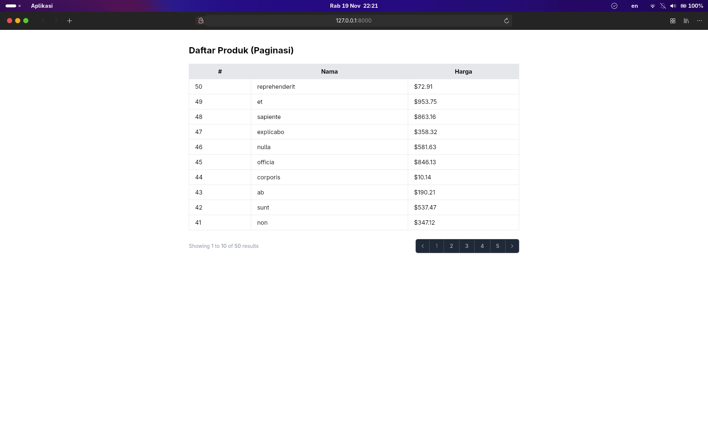

---

## 3. Hasil dan Pembahasan

Praktikum pada modul ini berhasil mendemonstrasikan cara kerja relasi Eloquent—meliputi One-to-One, One-to-Many, dan Many-to-Many—serta penerapan pagination pada Laravel.

Melalui rangkaian percobaan yang dilakukan:
1. Relasi One-to-One antara User dan Profile berhasil diterapkan, sehingga data profil dapat diakses secara langsung tanpa perlu menuliskan query SQL secara manual.

2. Relasi One-to-Many antara User dan Post mampu menampilkan daftar posting secara dinamis berdasarkan pemiliknya.

3. Relasi Many-to-Many antara Post dan Tag berjalan dengan baik menggunakan tabel pivot post_tag.

4. Fitur pagination juga berfungsi dengan optimal untuk menampilkan data produk dalam bentuk halaman dengan navigasi otomatis bawaan Laravel.

Secara keseluruhan, seluruh fitur yang diuji berjalan sesuai ekspektasi dan terbukti memudahkan pengelolaan data dalam jumlah besar, sekaligus menjaga struktur aplikasi tetap terorganisasi dan efisien melalui penggunaan Eloquent ORM.

--- 

## 4. Kesimpulan

Pada modul ini dipelajari bagaimana Laravel mengelola hubungan antartabel melalui Eloquent Relationship serta bagaimana proses penampilan data dapat dioptimalkan dengan Pagination.
Eloquent Relationship menyediakan mekanisme yang mempermudah pengembangan relasi seperti One-to-One, One-to-Many, dan Many-to-Many tanpa perlu menuliskan query SQL secara manual.
Sementara itu, Pagination berperan dalam meningkatkan pengalaman pengguna melalui penyajian data yang lebih terstruktur dan tersegmentasi.
Kedua konsep tersebut merupakan fondasi penting dalam membangun aplikasi Laravel yang efisien, terorganisasi, dan mampu berkembang dalam skala besar.

---

## 5. Referensi

- Laravel Documentation. Eloquent ORM - Relationships - https://laravel.com/docs/12.x/eloquent-relationships

- Laravel Documentation. Pagination - https://laravel.com/docs/12.x/pagination

- Modul 7 - Eloquent Relationship & Pagination – https://hackmd.io/@mohdrzu/r1RPvWaCxx