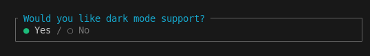
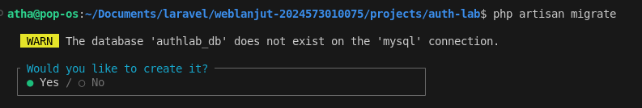

# Laporan Modul 6: Model dan Laravel Eloquent
**Mata Kuliah:** Workshop Web Lanjut<br>
**Nama:** Muhammad Dhiyaul Atha<br>
**NIM:** 2024573010075<br>
**Kelas:** TI 2B  

---

## Abstrak
Praktikum ini membahas implementasi sistem autentikasi dan otorisasi menggunakan Laravel 12.Praktikum pertama fokus pada Laravel Breeze untuk autentikasi pengguna, login, logout, registrasi, dan manajemen profil. Praktikum kedua mengimplementasikan kontrol akses berbasis peran (RBAC) dengan tiga peran: admin, manager, dan user. Middleware kustom digunakan untuk membatasi akses, sedangkan view khusus disiapkan untuk masing-masing peran. Praktikum ini menunjukkan bagaimana Laravel mempermudah pengelolaan autentikasi dan otorisasi yang aman.

---

## 1. Dasar Teori
- **Autentikasi:** Proses verifikasi identitas pengguna.  
- **Otorisasi:** Penentuan hak akses pengguna terhadap sumber daya aplikasi.  
- **Middleware:** Komponen yang memproses permintaan sebelum sampai ke controller, digunakan untuk melindungi rute.  
- **Laravel Breeze:** Starter kit Laravel untuk autentikasi minimal, termasuk login, registrasi, reset password, dan manajemen profil.  
- **RBAC (Role-Based Access Control):** Sistem kontrol akses berdasarkan peran pengguna.  
- **Gates & Policies:** Mekanisme Laravel untuk menegakkan aturan otorisasi pada model dan aksi tertentu.  
---

## 2. Langkah-Langkah Praktikum
### 2.1 Praktikum 1 – Autentikasi dan Otorisasi dengan Laravel 12 Breeze

>Langkah-langkah:
1. Buat proyek Laravel baru:  
   ```bash
   laravel new auth-lab
   ```
   atau jika menggunakan composer
   ```bash
   composer create-project laravel/laravel auth-lab
   ```
   masuk ke project, lalu buka code editor
   ```bash
   cd auth-lab
   code .
   ```

2. ubah konfigurasi .env
    ```bash
    DB_CONNECTION=mysql
    DB_HOST=127.0.0.1
    DB_PORT=3306
    DB_DATABASE=authlab_db
    DB_USERNAME=root
    DB_PASSWORD=
    ```
    sesuaikan username dan password database

3. Bersihkan config cache:
    ```bash
    php artisan config:clear
    ```

4. Instalasi Laravel Breeze
    Kita akan menggunakan Laravel Breeze untuk scaffolding autentikasi. Jalankan perintah berikut di terminal:
    ```bash
    composer require laravel/breeze --dev
    ```
    Kemudian, jalankan perintah berikut untuk menginstal Breeze:
    ```bash
    php artisan breeze:install
    ```
    Selama proses instalasi, Anda akan diminta beberapa opsi:
    Pilih frontend framework: Pilih blade
     
     Dark mode: Pilih yes (opsional)
     
    Lanjutkan dengan perintah berikut:
     ```bash
    npm install
    ```

5. Jalankan migrasi database
    ```bash
    php artisan migrate
    ```
    
    pilih yes untuk membuat database authlab_db ke mysql

6. Akses Register and Login via Web Interface.
 - jalankan perintah berikut untuk    memulai server development:
    ```bash 
    php artisan serve
    ```
 - Buka browser anda dan kunjungi
 http://localhost:8000

 - Registrasi pengguna baru dan login.
    klik register
    

    Kemudian, kita dapat mendaftarkan pengguna baru dengan mengklik tautan Register. Isi formulir pendaftaran dengan detail Anda dan klik Register. Ini akan membuat pengguna baru dalam database.

    Setelah mendaftar, Anda akan diarahkan ke halaman dashboard.

    Coba logout dan login kembali menggunakan kredensial yang baru saja Anda daftarkan. Anda dapat melakukan ini dengan mengklik tautan Login di pojok kanan atas.

7. Membuat Rute Profil yang Dilindungi
    Buat rute baru /myprofile yang dilindungi oleh middleware auth. Ini berarti hanya pengguna yang terautentikasi yang dapat mengakses rute ini.
    <i>routes/web.php</i>
    

8. Testing Rute Baru
    Login terlebih dahulu ke aplikasi

    Kunjungi http://localhost:8000/myprofile

    Verifikasi bahwa Anda melihat data user dalam format JSON yang berisi:
    id, name, email, email_verified_at, created_at, updated_at

    Anda dapat mengedit profil dengan mengklik tautan Profile. Ini akan membawa Anda ke halaman edit profil di mana Anda dapat memperbarui nama, email, dan kata sandi Anda.

### 2.2 Praktikum 2 – 

>Langkah-langkah:


## 3. Hasil dan Pembahasan


## 4. Kesimpulan


## 5. Referensi

- Laravel Documentation – Eloquent ORM - https://laravel.com/docs/12.x/eloquent

- Modul 6 – Model dan Laravel Eloquent – https://hackmd.io/@mohdrzu/ryIIM1a0ll